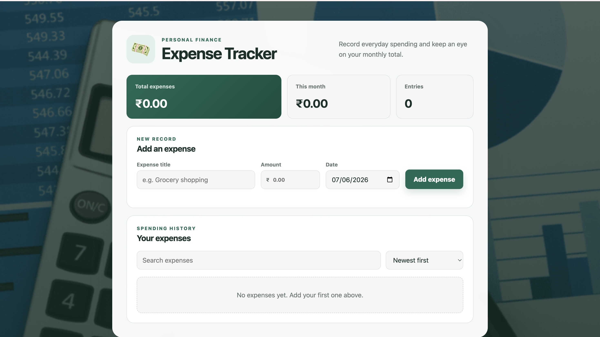

# Expense Tracker Dashboard

A modern Expense Tracker Dashboard built using HTML, CSS, and JavaScript that helps users monitor their income, expenses, and overall financial status through an intuitive and responsive interface.

## Live Demo

Add your Vercel deployment link here:

https://expense-tracker-dashboard-phi-nine.vercel.app/

## Features

- Add and track expenses
- Income and expense monitoring
- Real-time balance calculation
- Dashboard overview
- Responsive design
- User-friendly interface
- Financial summary cards
- Clean and modern UI

## Technologies Used

- HTML5
- CSS3
- JavaScript (ES6)

## Preview



## Project Structure

```text
Expense-Tracker-Dashboard/
├── index.html
├── style.css
├── script.js
├── screenshots/
│   └── dashboard-preview.png
└── README.md
```

## Features Overview

### Dashboard Analytics
- View total balance
- Monitor total income
- Track total expenses

### Expense Management
- Add new transactions
- Categorize expenses
- Maintain transaction history

### Financial Insights
- Monitor spending patterns
- Track financial activity
- Improve budget management

## Learning Outcomes

Through this project, I learned:

- DOM Manipulation
- JavaScript Event Handling
- Data Management
- Dashboard UI Design
- Responsive Web Development
- Financial Data Visualization

## Future Enhancements

- Local Storage Integration
- User Authentication
- Expense Categories
- Charts and Graphs
- Monthly Reports
- Export Data to Excel/PDF


## ⭐ Support

If you found this project useful, please consider giving it a star on GitHub.
